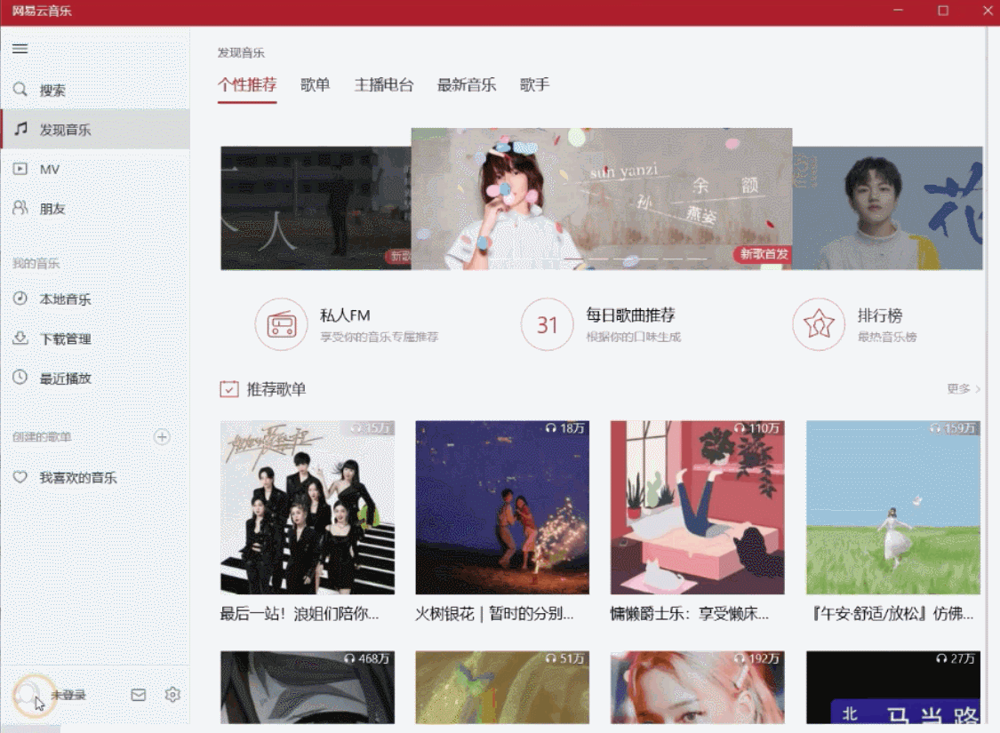

# 简介

经典的 网易云音乐 UWP 重打包版，可以与官方版共存。

# 下载

下载安装包： [x64 (64位)](./raw/master/cloudmusic.uwp_repack_x64.appx) | [x86 (32位)](./raw/master/cloudmusic.uwp_repack_x86.appx) | [arm32](./raw/master/cloudmusic.uwp_repack_arm.appx)

下载工具包： [全平台通用](./archive/refs/heads/tools.zip)


# 安装说明

由于Windows只允许安装来自**微软商店**或者**企业开发者**的appx/msix软件包，
所以我们需要先安装**自签名证书**来伪装成企业开发者，才能安装第三方软件包。

请选择以下其中一种方法：

#### 方法一：

1. 下载工具包，务必解压缩所有文件 (不要在压缩包内打开)

2. 打开```一键安装根证书.bat```，根据提示操作即可

3. 当显示内容包含 ```证书 "patched" 添加到存储``` 或者 ```证书 "patched" 已经在存储中``` 说明安装成功

> 某些杀毒软件可能会将此工具误报为病毒，您可能需要暂时关闭杀毒软件或者添加白名单才能使用。或者也可以考虑使用下面的方法二。

#### 方法二：

1. 下载工具包并解压缩，找到 ```data``` 文件夹里的 ```3.cer``` ，直接双击打开

> 如果您不知道这是什么，那么请忽略：~~如果您修改过.cer的文件关联，那么请在右键菜单的打开方式中选择加密外壳扩展。~~

2. 点击```安装证书```，将会进入"证书导入向导"

3. "存储位置"选```本地计算机```，下一步（需要同意管理员权限请求）

4. 选择```将所有的证书都放入下列存储```，点击```浏览```，选择```受信任的根证书颁发机构```，确定，下一步，继续完成证书导入。

5. 双击 x86 / x64 / ARM 的 ```appx``` 安装包安装

# 无法登录的解决方案

请选择以下其中一种方法：

#### 方法一（推荐）：



1. 点击 左下角“未登录”头像 → 关于网易云音乐，来到关于界面

2. 对界面右上角的网易云音乐 Logo 连续单击5下，然后迅速右击，会弹出调试对话框（如果不行则多试几次）

3. 将对话框中的服务地址 ```http://music.163.com``` 中的 ```http``` 改为 ```https```，即改为 ```https://music.163.com```，然后确认

4. 重启应用后登录

> 详情请参见 [b站专栏文章](https://www.bilibili.com/read/cv9556360/)

#### 方法二：

1. 点击 发现音乐 → 最新音乐，此时“我喜欢的音乐”会出现在应用左栏

2. 点击 创建的歌单 → 我喜欢的音乐 → “未登录”头像，然后登录

> 注：此方法应该只支持网易账号和手机号

# 无法下载音乐的解决方案

在 **Windows11 22H2** 及之后版本的系统中，存在无法下载音乐的问题：显示文件保存失败。

请选择以下其中一种解决方法：

#### 方法一（激进）：

> **实现原理：**修改特定文件夹权限，使其可被软件访问。

1. 下载工具包，务必解压缩所有文件 (不要在压缩包内打开)

2. 双击打开```授权访问外部路径.vbs```
 - 选择"是"将授权默认的下载目录 (用户文件夹>音乐)
 - 选择"否"可以选择其他路径进行授权 (需要手动在软件内同步修改下载路径)

>-  授权自定义下载目录时请特别注意：
  - 授权自定义目录时，请尽可能减小授权范围到专用的文件夹，
    尽量避免授权无关路径，尤其是不要授权整个磁盘或者%userprofile%路径！
  - 假设您想使用 **D:\个人\音乐\CloudMusic** 作为下载路径，
    那么只需要授权 **CloudMusic** 这个文件夹即可；
    需慎重选用 **~~D:\个人\音乐~~** ，绝对不要随意授权 **~~D:\个人~~** 甚至 **~~D:\~~**

#### 方法二（保守）：

1. 下载工具包，务必解压缩所有文件 (不要在压缩包内打开)

2. 

# 进阶：本地回环代理设置

> 如果您不知道这是做什么的，那么请忽略这一项

管理员命令行运行：

`checknetisolation loopbackexempt -a -n="cloudmusic.uwp_6p888gkwt396e"`

#其他已知问题

在 Windows11 22H2 版本之上，无法下载音乐，见 [该 issue](https://github.com/JasonWei512/NetEase-Cloud-Music-UWP-Repack/issues/24) 。

# 打包方式说明

见 [该 issue](https://github.com/JasonWei512/NetEase-Cloud-Music-UWP-Repack/issues/3#issuecomment-636415035)。
