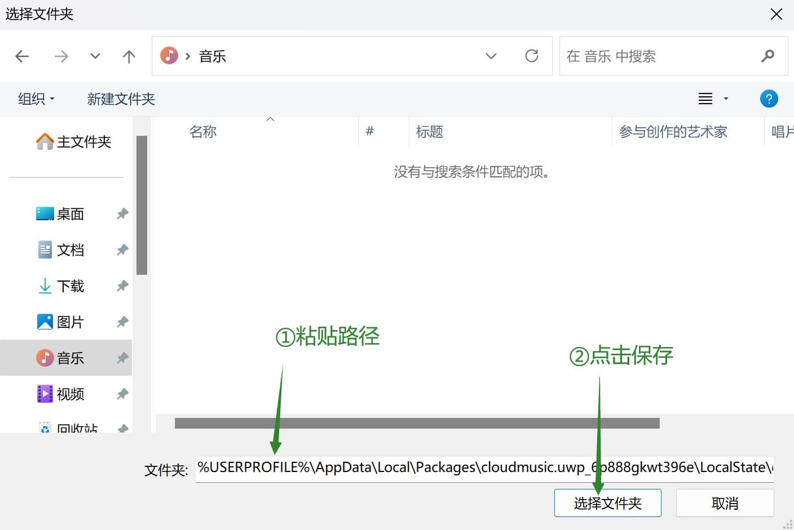

# 无法下载音乐的解决方案

在22H2及更高版本的Windows11中下载音乐时提示文件存储失败。

请选择以下其中一种解决方法：

#### 方法一（激进）：

> 实现原理：修改特定文件夹权限，使其可被软件访问。

1. 下载工具包，务必解压缩所有文件 (不要在压缩包内打开)

2. 双击打开```授权访问外部路径.vbs```
 - 选择"是"将授权默认的下载目录 (用户文件夹>音乐)
 - 选择"否"可以选择其他路径进行授权 (需要手动在软件内同步修改下载路径)

> 特别注意：<br />
  授权自定义目录时，请尽可能减小授权范围到专用的文件夹，
  尽量避免授权无关路径，尤其是不要授权整个磁盘或者%userprofile%路径！<br />
  假设您想使用 **D:\个人\音乐\CloudMusic** 作为下载路径，
  那么只需要授权 **CloudMusic** 这个文件夹即可；
  需慎重选用 **~~D:\个人\音乐~~** ，绝对不要随意授权 **~~D:\个人~~** 甚至 **~~D:&#92;~~**

#### 方法二（保守）：

> 实现原理：请参见 [issue](https://github.com/JasonWei512/NetEase-Cloud-Music-UWP-Repack/issues/24)

1. 下载工具包，务必解压缩所有文件 (不要在压缩包内打开)

2. 双击运行```改用内部下载路径.vbs``` 。<br />
如果提示权限不足，请关闭云音乐软件后尝试以管理员身份再次运行此vbs脚本

3. 打开云音乐UWP，重新登录后测试是否可以正常下载音乐。<br />
如果可以，请不要再改动程序设置中的下载路径。<br />
如果仍然无法下载，请参照下图，将下载路径设置为<br />
 ```%USERPROFILE%\AppData\Local\Packages\cloudmusic.uwp_6p888gkwt396e\LocalState\download\music```


